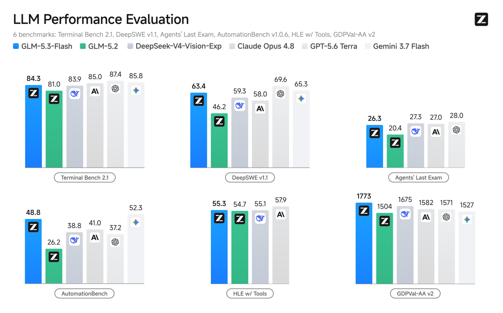

# GLM-5.3-Flash — The Stealth Model "0x Alpha" Was Real, and It's a Fast, Free Coding Powerhouse

Remember 0x Alpha — the mysterious model that showed up on OpenRouter with a 1M-token context and coding chops that had everyone guessing? The developers confirmed it to Bloomberg: **it was GLM-5.3-Flash**, Z.AI's new speed-tuned coding model, and the weights are out. Same GLM-5.3 intelligence the community was raving about, tuned to run faster and lighter — and free. This is the one-click desktop client: no terminal, no config, no points system. Download, double-click, and code with the model everyone spent a week trying to identify.

   

  

---

## The reveal, quickly

For a week, "0x Alpha" was the most talked-about stealth model in the coding community — a 1.05M-token context, 131K output, multimodal, and agentic coding strong enough that testers rated it against frontier models without knowing who made it. Now it's confirmed: it's **GLM-5.3-Flash** from Z.AI. If you were impressed by 0x Alpha, you were impressed by this — now with open weights, an official name, and a desktop app built around it.

## Why Flash is the one you actually want to code with

GLM-5.3-Flash is the speed-and-efficiency cut of GLM-5.3 — the same generation that ranks at the top of open-weights coding, distilled for fast, responsive, low-cost work:

- **Fast.** Flash is tuned for speed — snappy responses on interactive coding instead of long waits, which is what makes it feel great for building in real time.
- **Same 5.3 coding lineage.** It carries the GLM-5.3 generation's coding strength — the jump that put GLM at the top of open-weights coding benchmarks — in a lighter, quicker package.
- **1M-token context.** Load a whole codebase and keep it in view; nothing slides out mid-task.
- **Multimodal.** Text, images, video in — hand it a screenshot or a diagram and build from it.
- **Big outputs.** Room for large single-pass generations — whole files and modules at once.
- **Free.** As the Flash tier, it's the free, accessible way into GLM-5.3-class coding.
## Free & fast vs the full model vs setting it up yourself

| | GLM-5.3 (full) | DIY (llama.cpp/API) | GLM-5.3-Flash (this app) |
|---|---|---|---|
| Speed | High quality, heavier | Depends on your setup | **Fastest, tuned for it** |
| Cost | Paid tiers | Free (self-run) | **Free** |
| Setup | API/CLI/points | Terminal, quant math | **One click** |
| Context | 1M | 1M | **1M** |
| Coding quality | Top open-weights | Same model | **GLM-5.3 lineage** |
| Local project library | No | No | **Yes** |

Pick the full model when you want maximum quality on the hardest problems; pick Flash — this app — when you want fast, free, responsive coding for everyday building.

## What it's great at

**Fast, flowing coding** is the whole reason Flash exists, and the app is built around it:

- **Vibe-code in real time** — the speed makes conversational building feel immediate instead of laggy
- **Whole-codebase work** — 1M context holds a real project for cross-file refactors
- **Agentic, multi-step tasks** — the sustained "work through this" jobs 0x Alpha earned its reputation on
- **Vision-assisted dev** — build from screenshots, mockups, and diagrams

## One-click install

The official routes to GLM are the API, a CLI, and a points-based plan. This is just an app:

[View all releases](../../releases)

- **Windows** → `GLM-5.3-Flash-x64.7z`, double-click. Signed, SmartScreen-clean.
- **Mac** → `GLM-5.3-Flash.dmg`, drag to Applications. Notarized, Apple Silicon + Intel.
No Python, no keys to paste to start, no points to ration. Open it and build.

## The perks of this build

- **🆓 Free.** Flash is the accessible tier — full coding access in the app, no card to start.
- **⚡ Instant & lightweight.** Small install, fast launch, and Flash's speed tuning on top.
- **🗄 Local project library.** Your prompts, chats, and code stay organized on your machine, private by default.
- **🎟 Open weights available.** GLM-5.3-Flash's weights are released — run it locally on your own hardware if you want, and this app is the zero-setup way to use it now.
## FAQ

**Wait — 0x Alpha was GLM-5.3-Flash?**
Yes. The stealth model that appeared on OpenRouter and OpenCode Zen was confirmed by the developers, to Bloomberg, as GLM-5.3-Flash. The specs everyone noted — 1.05M context, 131K output, multimodal, strong agentic coding — are this model. Now it has a name, open weights, and a desktop client.

**Is it really free?**
Yes — Flash is the free, accessible tier of the GLM-5.3 generation, and this app uses that access, no card to start. It's the low-cost way into GLM-5.3-class coding. (Terms can evolve as any new release settles, but it's genuinely free to use now.)

**How is Flash different from full GLM-5.3?**
Flash is tuned for speed and efficiency — faster, lighter, free — while the full model targets maximum quality on the hardest problems. Same generation and coding lineage; Flash trades a little top-end for a lot of speed and accessibility. For everyday building, Flash feels better because it's quick.

**Is it safe to install?**
Signed on Windows, notarized on Mac, SHA-256 checksums published, source on GitHub. Weights are Z.AI's official GLM-5.3-Flash release. Download only from the Releases page here.

**What's it best at?**
Fast, agentic, long-horizon coding — vibe-coding, whole-repo refactors, multi-step tasks — with 1M context and multimodal input. It's the speed-tuned coder that spent a week impressing people as "0x Alpha."

---

*Independent third-party desktop client for GLM-5.3-Flash, Z.AI's open-weights coding model (the model previously previewed as "0x Alpha," confirmed by its developers). Not affiliated with, endorsed by, or operated by Z.AI. "GLM," "GLM-5.3-Flash," "0x Alpha," and "Claude" are referenced solely to identify the model this client connects to or the preview it came from (nominative fair use). Generation runs through GLM-5.3-Flash under Z.AI's terms; free access is via the model's current availability and may evolve. Benchmark and capability figures reference Z.AI's reported results; real-world performance varies. MIT-licensed client — see [LICENSE](LICENSE).*

If the model you knew as 0x Alpha is now your daily coder, a ⭐ helps others find it under its real name.
